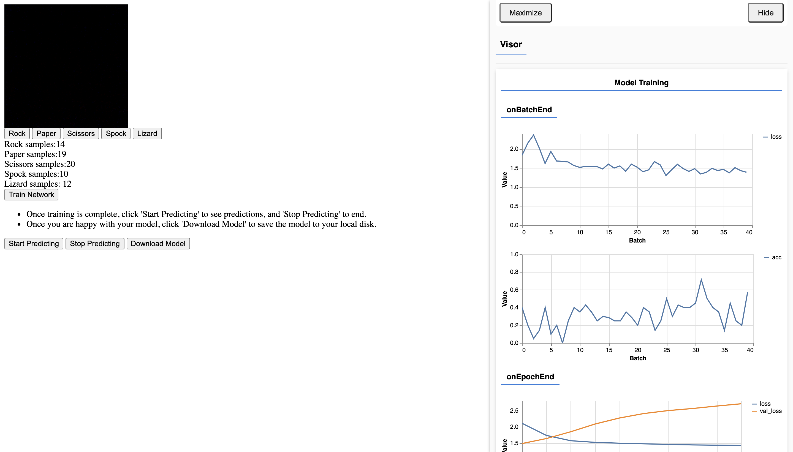

# Rock-paper-scissor-Lizard-Spock

---

**Predicting hand signs from the famous game using tensorflow.js**

- In this project we'll create a rock-paper-scissor-lizard-spock image classifier.
- We'll be using tensorflow-js for this project.
- We'll have to create our own dataset, this can be done via the interface designed for this project.
- The CNN architecture used for classification is `MobilenetV1`.

### Interface

#### Usage

- Make a sign eg. closed fist for rock, and click on the `rock` button to add a image for it.
- Similary you'll have to do it for the rest of the classes.
- Add as many as 50-100 images per classes for better result.
- You can add a small amount of images and then click on `Training` and `Start Predicting` to check if the results are good.
- If not, you can simply add more images to the classes and train again.
- When satisfied with the result, you can click on `Stop Training` and download the trained model.

### Enjoy
